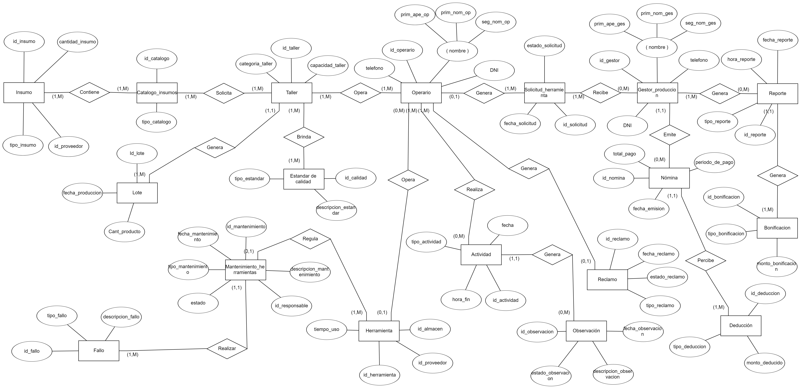
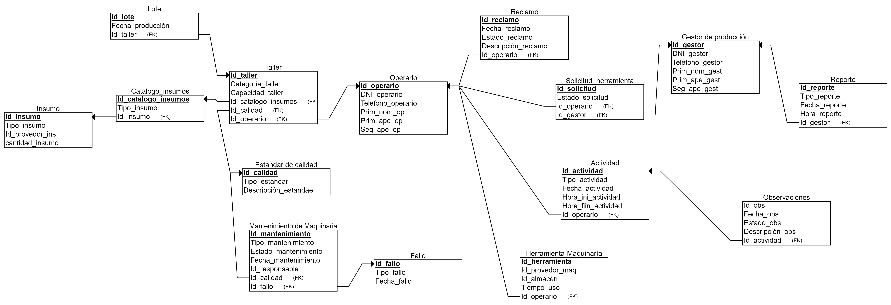

# Modelado Conceptual

# Modelo Lógico

# Diccionario de datos
### Entidad: Operario
#### Se refiere a un individuo que trabaja en la división de producción de la empresa TOPITOP, desempeñando roles y tareas relacionadas con la fabricación de productos textiles de acuerdo con los estándares de calidad y diseño establecidos.

|     Atributo     |                  Descripción                  |   Formato   | Naturaleza |  Valores |
|:----------------:|:---------------------------------------------:|:-----------:|:----------:|:--------:|
|    ID_operario  |              Código del operario             |   AA999 |   char  | 3 dígitos+ 2 letras paridad|
|  Nombre_operario |          Nombre del empleado                  |     X(60)    |   char   | NOT NULL |
| Apellido_operario|          Apellido del empleado                |     X(60)     |   char  | NOT NULL |
|  DNI_operario   |          documento de indentidad del empleado  |  99999999   |  char |  8 dígitos|
|     Teléfono     |        Número de teléfono del empleado        | 999 999 999 |    Char    | 9 dígitos |

### Entidad: Gestor de Produccion
#### Se refiere a un individuo que trabaja en la gestion de producción de la empresa TOPITOP, desempeñando roles y tareas relacionadas con  organizar, dirigir y controlar todas las actividades relacionadas con la producción, con el objetivo de garantizar la eficiencia y rentabilidad de la empresa

|     Atributo     |                  Descripción                  |   Formato   | Naturaleza |  Valores |
|:----------------:|:---------------------------------------------:|:-----------:|:----------:|:--------:|
|    ID_gestor  |              Código del operario             |   AA999 |   Varchar  | 3 dígitos+ 2 letras paridad|
|  Nombre_gestor |          Nombre del empleado                  |     X(60)    |   char   | NOT NULL |
| Apellido_gestor|          Apellido del empleado                |     X(60)     |   char  | NOT NULL |
|  DNI_gestor    |          documento de indentidad del empleado  |  99999999   |  char |  8 dígitos|
|     Teléfono     |        Número de teléfono del empleado        | 999 999 999 |    Char    | 9 dígitos |

### Entidad: Solicitud de herramienta
#### Se refiere al pedido realizado por un empleado para el uso de una maquinaria específica en el area producción de la empresa TOPITOP.

|     Atributo     |                  Descripción                  |   Formato   | Naturaleza |  Valores |
|:----------------:|:---------------------------------------------:|:-----------:|:----------:|:--------:|
|    ID_Solicitud |              Código del solicitud              |   9999-AAA   |   char  | 4 dígitos + 3 letras paridad|
|  Fecha_Solicitud |          Fecha en que se realiza la solicitud |    YYYY-MM-DD  |  Date  | NOT NULL |
| Estado           |          Estado actual de la solicitud         |   AAA   |   char  | TAB 1 |

#### TAB 1

|     Cargo    |    Semantica |
|:---------------:|:-----------------:|
|     E1    |    Disponible|
| E2 |  Mantenimiento |
| E3 |  Ocupado |

### Entidad: Herramienta
#### Se refiere al pedido realizado por un empleado para el uso de una maquinaria o herramienta específica en el area producción de la empresa TOPITOP.

|     Atributo     |                  Descripción                  |   Formato   | Naturaleza |  Valores |
|:----------------:|:---------------------------------------------:|:-----------:|:----------:|:--------:|
|  ID_herramienta |              Código de de la maquinaria             |   99999-AA   |   Varchar  | 5 dígitos + 2 letras paridad|
|  Nombre_Herramienta |          Nombre de la maquinaria   |  YYYY-MM-DD  |  Date  | NOT NULL |
| Modelo_Herramienta        |          Modelo de la maquinaria       |   AAA   |   char  | No null |
| tiempo de uso       |          tiempo de uso la maquinaria       |   99:99 H   |   time | No null |

### Entidad: Insumo
#### Se refiere a los insumos utilizados en el proceso de producción de la empresa. Los operarios pueden realizar solicitudes de pedido de insumos a través del sistema.
|     Atributo      |              Descripción                  |   Formato   | Naturaleza |  Valores |
|:-----------------:|:-----------------------------------------:|:-----------:|:----------:|:--------:|
|   id_insumo       |        Código del insumo                  |   AAA999   |   char  | 3 dígitos+ 3 letras paridad|
|   tipo_insumo     |        Tipo de insumo                      |     X(60)   |   Char     | NOT NULL |
|   cantidad_insumo |        Cantidad del insumo                 |     999     |   Int      | NOT NULL |
|   id_proveedor    |        Código del proveedor del insumo     |   999999    |   char| 6 dígitos|

### Entidad: FALLO
#### Un fallo representa un defecto, problema o anomalía identificada en una herramienta o maquinaria que afecta su funcionamiento, rendimiento o calidad.

|     Atributo      |              Descripción                  |   Formato   | Naturaleza |  Valores |
|:-----------------:|:-----------------------------------------:|:-----------:|:----------:|:--------:|
|   ID_FALLO        |  dentificador único del fallo             |   AA999    |  char    | 3 dígitos+ 2 letras paridad|
| DESCRIPCION_FALLO | Descripción detallada del fallo   |  X(60)       |   Char     | NOT NULL |

### Entidad: INSPECCION
#### Una inspección representa el proceso de revisión y evaluación de herramientas o maquinarias para verificar su estado, calidad y funcionamiento de acuerdo con los estándares establecidos.
|     Atributo      |              Descripción                  |   Formato   | Naturaleza |  Valores |
|:-----------------:|:-----------------------------------------:|:-----------:|:----------:|:--------:|
|   ID_inspeccion            |Identificador único de la inspección |      999999 |   INT  | 6 dígitos|
| ID_RESPONSABLE             | Identificador del responsable de la inspección  |      999999 |   INT  | 6 dígitos|
|  ID_HERRANMIENTA_MAQUINARIA|  Identificador de la herramienta o maquinaria inspeccionada | 999999 | INT  | 6 dígitos|
|   RESULTADO                |  Resultado de la inspección |   VARCHAR(70)   |  X(60)   |   Char   | NOT NULL |
|   FECHA_INSPECCION         | Fecha en que se realizó la inspección     |  YYYY-MM-DD |    Date    |  NOT NULL  |
|   OBSERVACIONES | Observaciones adicionales sobre la inspección  |  VARCHAR(70)   |  X(60)       |   Char     | NOT NULL |

  ### Entidad: MANTENIMIENTO_MAQUINARIA
#### El mantenimiento de herramientas y maquinarias es el conjunto de actividades preventivas y correctivas realizadas de manera regular para asegurar su funcionamiento óptimo, prolongar su vida útil y prevenir fallos o defectos.

|     Atributo      |              Descripción                  |   Formato   | Naturaleza |  Valores |
|:-----------------:|:-----------------------------------------:|:-----------:|:----------:|:--------:|
| ID_MANTENIMIENTO  | Identificador único del mantenimiento |      AAA999 |   INT  | 3 dígitos+ 3 letras paridad|
| DESCRIPCION_MANTENIMIENTO|  Descripción detallada del mantenimiento |   VARCHAR(70)|  X(60)  | Char | NOT NULL |
| TIPO_MANTENIMIENTO |    Tipo de mantenimiento   | TAB            |             |     | |
| ID_RESPONSABLE | Identificador del responsable del mantenimiento    |      999999 |   INT  | 6 dígitos|
|ESTADO |     Estado actual del mantenimiento    |             |     | |
| FECHA_MANTENIMIENTO | Fecha en que se realizó el mantenimiento       |  YYYY-MM-DD |    Date    |  NOT NULL  |

#### TAB 2

|     Cargo    |    Semantica |
|:---------------:|:-----------------:|
| M1 |  PREVENTIVO |
| M2 |  CORRECTIVO |

  ### Entidad: ESTANDAR_CALIDAD
#### Un estándar de calidad es una norma o criterio establecido que define las características, propiedades o condiciones que debe cumplir un producto, herramienta o maquinaria para ser considerado como de calidad aceptable.

|     Atributo      |              Descripción                  |   Formato   | Naturaleza |  Valores |
|:-----------------:|:-----------------------------------------:|:-----------:|:----------:|:--------:|
|   ID_Estandar     | Identificador único del estándar de calidad|      AAA999 |   char  | 3 dígitos+ 3 letras paridad|
| Tipo_Estandar     |   Tipo o categoría del estándar |  Texto    |VARCHAR(50)  |  	NOT NULL        |
| Descripcion       |   Descripción detallada del estándar  |  Texto    |VARCHAR(50)  |  	NOT NULL        |
| Fecha_Creacion    |  Fecha de creación o última actualización del estándar |  YYYY-MM-DD |    Date    |  NOT NULL  |

### Entidad: Reportes
#### Se refiere al pedido realizado por un empleado para el uso de una maquinaria específica en el area producción de la empresa TOPITOP.

|     Atributo     |                  Descripción                  |   Formato   | Naturaleza |  Valores |
|:----------------:|:---------------------------------------------:|:-----------:|:----------:|:--------:|
|    ID_REPORTE |              Código del reporte            |   999AAA9   |   char  | <999 caracteres alfanumericos|
|  FECHA_REPORTE |          Fecha del reporte   |  YYYY-MM-DD  |  Date  | NOT NULL |
| HORA_REPORTE      |          Hora del reporte       |   HH-MM   |   Date  | NOT NULL |
| TIPO_REPORTE      |          Tipo de reporte       |   AAA   |   char  | TAB 3 |

#### TAB 3

|     Tipo de reporte    |    Semantica |
|:---------------:|:-----------------:|
|     R1    |    Reporte por herramienta|
| R2 |  Reporte por maquinaria |
| R3 |  Reporte por operario |
| R4 |  Reporte por operaro (visualización del operario) |

### Entidad: Actividad
#### Se refiere a cualquier proceso o precedimiento que realiza un operario al momento de la fabricación de prendas en el area producción de la empresa TOPITOP.

|     Atributo     |                  Descripción                  |   Formato   | Naturaleza |  Valores |
|:----------------:|:---------------------------------------------:|:-----------:|:----------:|:--------:|
|    ID_ACTIVIDAD |              Código de la actividad            |   AAA999   |   char  | 3 dígitos+ 3 letras paridad |
|  TIPO_ACTIVIDAD |          Tipo de actividad   |  AAA9 |  char  | TAB 4 |
|  FECHA_ACTIVIDAD |          Fecha de la actividad   |  YYYY-MM-DD  |  Date  | NOT NULL |
| HORA_INI_ACTI    |          Hora del inicio de la actividad       |   HH-MM   |   Date  | NOT NULL |
| HORA_FIN_ACTI      |           Hora del final de la actividad       |   HH-MM   |   Date  | NOT NULL |

#### TAB 4

|     Tipo de actividad    |    Semantica |
|:---------------:|:-----------------:|
|     A1    |    Lavado de prenda|
| A2 |  Secado de prenda |
| A3 |  Costura de prenda |
| A4 |  Acabados de prenda |
| A5 |  Correciones de prenda |
| A6 |  Planchado de prenda |
| A7 |  Empaquetamiento de lotes |

### Entidad: Taller
#### Se refiere a los diferentes lugares donde se hace alguna actividad de producción de prendas en el area de producción de la empresa TOPITOP.

|     Atributo     |                  Descripción                  |   Formato   | Naturaleza |  Valores |
|:----------------:|:---------------------------------------------:|:-----------:|:----------:|:--------:|
|    ID_TALLER |              Código del taller           |   AA999   |   char | <999 caracteres alfanumericos|
|  CAPACIDAD_TALLER |          Capacidad del taller   | 99999 |  Int  | >0 |
|  CATEGORÍA_TALLER |          Categoría  de las actividades que se realizan en el taller  |  YYYY-MM-DD  |  Char | TAB 5 |

#### TAB 5

|     Categoria del taller    |    Semantica |
|:---------------:|:-----------------:|
|     T1    |    Taller de Lavado |
| T2 |  Taller de Secado  |
| T3 |  Taller de Costura  |
| T4 |  Taller de Acabados  |
| T5 |  Taller de Correciones |
| T6 |  Taller de Planchados |

### Entidad: Reclamo
#### Se refiere a un informe formal presentado por un empleado de la empresa en el que se expone una preocupación, queja, problema o incidente relacionado con su experiencia laboral.

|     Atributo     |                  Descripción                  |   Formato   | Naturaleza |  Valores |
|:----------------:|:---------------------------------------------:|:-----------:|:----------:|:--------:|
|  id_reclamo |              Código del reclamo           |   AA999   |   Varchar  |2 dígitos+ 3 letras paridad |
|  fecha_reclamo |     Fecha en la que se realiza el reclamo   | YYYY-MM-DD |  Date  | NOT NULL |
|  descripcion_reclamo |      Descripción detallada del reclamo |  X(60)|  Varchar | NOT NULL |
|  estado_reclamo |      Situación en la que se encuentra el reclamo  | A |  Char | TAB 6 |
|  id_operario |      Código del operario que realiza el reclamo  | 999999 |  Varchar | 6 dígitos|

#### TAB 6

|     Estado del Reclamo    |    Semantica |
|:---------------:|:-----------------:|
| P |  Reclamo pendiente |
| R |  Reclamo resuelto |

### Entidad: Observaciones
#### Una observación representa una sugerencia, comentario, idea o propuesta presentada por un empleado de la empresa para mejorar algún aspecto de la operación, proceso o ambiente laboral.

|     Atributo     |                  Descripción                  |   Formato   | Naturaleza |  Valores |
|:----------------:|:---------------------------------------------:|:-----------:|:----------:|:--------:|
|  id_obs |       Código de la observación        |  AAA999  |   char  | 3 dígitos+ 3 letras paridad |
|  fecha_obs |   Fecha en la que se registra la observación  | YYYY-MM-DD |  Date  | NOT NULL |
|  descripcion_obs |  Descripción detallada de la observación realizada | X(60) |  Char | NOT NULL |
|  estado_obs |  Situación en la que se encuentra la observación | A |  Char | TAB 7 |
|  id_actividad |  Código de la actividad de la cual se obtiene la observación | 999AA99 |  Varchar | <999 caracteres alfanuméricos |

#### TAB 7

|     Estado de la observación    |    Semantica |
|:---------------:|:-----------------:|
| P |  Observación pendiente |
| R |  Observación resuelta |
