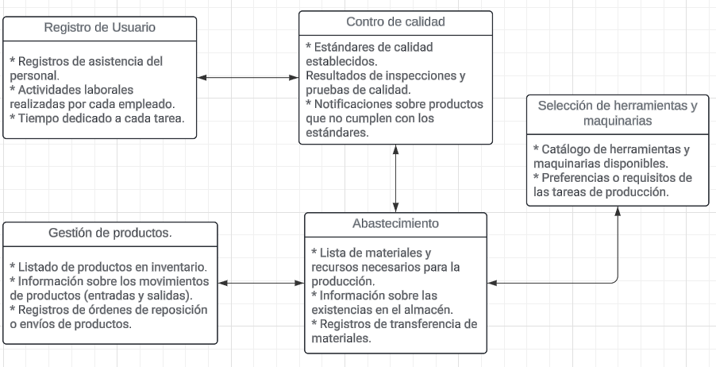

# MODULOS 

## MÓDULO DE LOGIN

Este módulo se encarga de gestionar el proceso de inicio de sesión de los usuarios (empleados y administradores) y a su vez validar este mismo proceso, validar los datos de loggeo. También servirá de dar las funcionalidades respectivas al usuario dependiendo de qué datos se ingresen y per la recuperación de contraseñas en caso de olvidos de los usuarios

## MÓDULO DE LOGIN Y REGISTRO DE USUARIO 

Este módulo se encarga de poder registrar su perfil , como nombres, cargo de ocupación. Tambien se encarga de poder actualizar la contraseña mediante una verificación de una "palabra clave", y si contesta correctamente según la base de datos se procede a actualizar la contraseña
1. 

## MÓDULO DE SELECCION DE HERRAMIENTAS Y MAQUINARIAS

El Módulo de Selección de Herramientas y Maquinarias es fundamental para garantizar un proceso de producción eficiente y seguro en la empresa Topitop, especializada en la elaboración de prendas de vestir. A continuación, profundizaremos en los aspectos clave de este módulo:

1. Conocimiento del Proceso y Tareas Específicas: Los operarios deben comprender a fondo el proceso de producción y las etapas en las que intervienen. Esto les permitirá elegir las herramientas y maquinarias adecuadas para cada tarea específica.
2. Características de las Herramientas y Maquinarias: Los operarios deben conocer las características técnicas de las herramientas y maquinarias disponibles. Esto incluye detalles como la capacidad, velocidad, precisión, facilidad de uso y mantenimiento.
3. Adaptación al Trabajo: Las herramientas y maquinarias deben adaptarse al tipo de trabajo que se realiza. Por ejemplo, si se trata de costura, la elección de la máquina de coser adecuada es esencial.
4. Seguridad y Ergonomía: Los operarios deben considerar la seguridad al elegir herramientas. Evaluar si la herramienta es cómoda de usar durante largos períodos y si cumple con las normas de seguridad.
5. Eficiencia y Productividad: Seleccionar herramientas que permitan una mayor eficiencia y productividad. Evaluar si la herramienta reduce el tiempo de trabajo y mejora la calidad del producto final.
6. Colaboración y Retroalimentación: Los operarios pueden colaborar entre sí y compartir experiencias sobre qué herramientas funcionan mejor en diferentes situaciones. La retroalimentación constante ayuda a mejorar la elección de herramientas con el tiempo.

## MÓDULO DE REGISTRO LABORAL 
Este módulo se encarga sobre gestionar de manera eficaz la mano de obra y optimizar los procesos de fabricación. este Modulo permite registrar y gesionar la información relacionada con el trabajo de los empleados en las lienas de producción de calzado, se especifica en los siguientes pasos 
1. registro de entrada y salida: El módulo permite registrar la hora de entrada y salida de los empleados en sus jornadas laborales. esto proporciona un seguimiento preciso del tiempo trabajanod por cada empleado
2. monitoreo de progreso: permite monitorear el progreso de las tareas asignadas en tiempo real. los encargados de este módulo peden verificar el estado de las acividades en curso y realizar ajustes según sea necesario para garantizar que se cumpla los plazos y objetios de producción
3. asignación de tareas y turnos: permite asignar tareas especificas a los empleados en función de sus habilidades y la disponibiidad que tienen, con esto asegura una una distribución equitativa del trabajo y una correcta asignación eficiente de recursos humanos en cada turno de producción
4. registro de ausencia y tiempo libre: permite registrar el tiempo extra trabajado por los empleados , así como las ausencia de estos en el trabajo; vacaciones o días libres como tambien las ausencias no planificadas como enfermedades, con esto se puede garantizar una correcta cobertura adecuada en la linea de producción.
5. generación de informes y análisis: El módulo ofrece la generación de informes detallados sobre la asistencia y el rendimiento laboral de los empleados. Con esto generamos una información valiosa para evaluar la eficiencia operativa, identificar areas de mejora y tomar mejores decisiones.

## MÓDULO DE CONTROL DE CALIDAD
Es una pieza fundamental para garantizar la excelencia en los productos fabricados. Aquí está cómo funcionaría este módulo
 1. Registro de Inspecciones: Permite registrar los resultados de las inspecciones de calidad realizadas en los productos terminados, así como en los materiales y componentes utilizados en el proceso de fabricación. Esto incluye la evaluación de aspectos como la apariencia, la resistencia, la durabilidad y otros criterios de calidad definidos por la empresa.
2. Control de Procesos: Permite monitorear y controlar los procesos de fabricación para asegurar que se cumplan los estándares de calidad establecidos. Esto puede incluir la implementación de controles en línea durante la producción para detectar y corregir posibles problemas de calidad de manera oportuna.
3. Seguimiento de No Conformidades: Permite registrar y gestionar las no conformidades identificadas durante las inspecciones de calidad. Esto incluye el registro de las causas de las no conformidades, así como las acciones correctivas y preventivas implementadas para abordarlas y evitar su recurrencia.
4. Análisis de Datos: Ofrece la capacidad de analizar los datos recopilados durante las inspecciones de calidad para identificar tendencias, patrones y áreas de mejora en los procesos de fabricación. Esto permite tomar decisiones informadas para optimizar la calidad y la eficiencia operativa.
5. Definición de Estándares de Calidad: Permite establecer y mantener los estándares de calidad para los productos y materiales. Esto implica definir los criterios de aceptación y rechazo, así como los procedimientos de prueba y los niveles de tolerancia para cada aspecto de la calidad.

# INTERACCIONES ENTRE LOS MODULOS

## MÓDULO DE ABASTECIMIENTO CON MÓDULO DE SELECCION DE HERRAMIENTAS Y MAQUINARIAS

El Módulo de Abastecimiento del Almacén al Área de Producción puede recibir solicitudes de materiales y recursos en tiempo real desde el Módulo de Selección de Herramientas y Maquinarias, en función de las necesidades de producción detectadas.

## MÓDULO DE REGISTRO LABORAL CON MÓDULO DE CONTROL DE CALIDAD

El Módulo de Registro Laboral puede comunicarse en tiempo real con el Módulo de Control de Calidad para proporcionar información sobre el personal asignado a ciertas tareas de inspección o control.

## MÓDULO DE CONTROL DE CALIDAD CON MÓDULO DE ABASTECIMIENTO

El Módulo de Control de Calidad puede enviar notificaciones en tiempo real al Módulo de Abastecimiento del Almacén al Área de Producción sobre productos que no cumplen con los estándares de calidad, lo que puede afectar la planificación de la producción.

## MÓDULO DE GESTIÓN DE PRODUCTOS CON MÓDULO DE ABASTECIMIENTO

El Módulo de Gestión de Productos que se tiene que llevar o traer del Almacén puede actualizarse en tiempo real a medida que los productos terminados son aprobados por el Módulo de Control de Calidad y están listos para ser transferidos al almacén o enviados al cliente.

# PROCESOS BATCH INVOLUCRADOS

- Los registros de asistencia y actividades laborales del Módulo de Registro Laboral pueden ser procesados en lotes al final de cada jornada laboral para generar informes de productividad y calcular la remuneración del personal.

- La gestión de inventario del Módulo de Productos que se tiene que llevar o traer del Almacén puede realizar procesos batch periódicos para actualizar los niveles de stock, identificar productos obsoletos o próximos a caducar, y generar órdenes de reposición de manera automática.

- Los datos recopilados por el Módulo de Control de Calidad pueden ser analizados en lotes para identificar tendencias, áreas de mejora en los procesos de producción y posibles ajustes en los estándares de calidad.

# DIAGRAMA UML

[Selección de la empresa](SeleccionEmpresa.md)

[Regresar al índice](../README.md)

