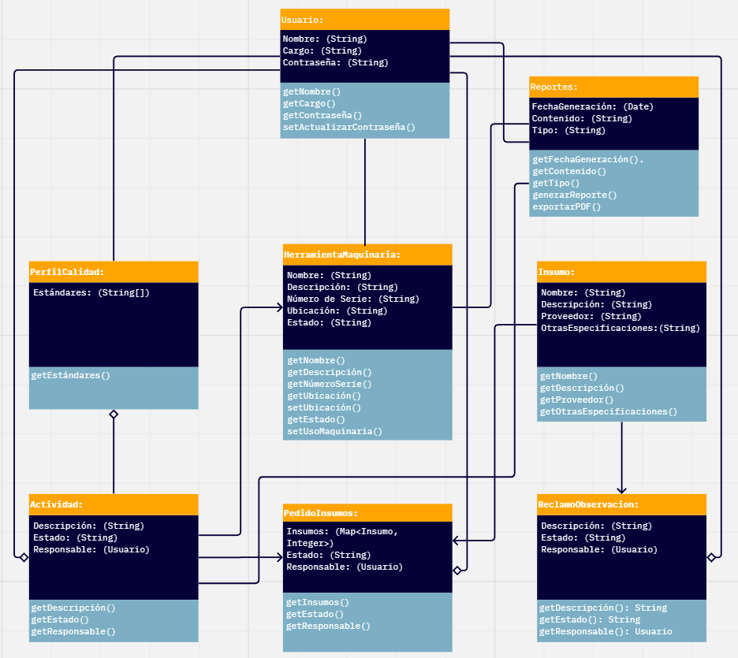

# MODULOS 

## MÓDULO DE LOGIN Y REGISTRO DE USUARIO 

Este módulo se encarga de registrar el perfil del usuario, recopliando información relevante como nombres y cargos de ocupación. Tambien se encarga de actualizar la contraseña mediante una verificación conocida como "palabra clave" y si contesta correctamente, según la base de datos, se procede a actualizar la contraseña. 
1. Ingreso de usuario y contraseña: Los empleados tendrán asignados perfiles de usuario con sus respectivas contraseñas.
2. Cambio de contraseña: Si el usuario no recuerda la contraseña, se le puede otorgar la función de poder actualizarla mediante un control de seguridad llamado "palabra clave", y si responde correctamente se procede a la actualización de la contraseña.
3. Actualización de datos del usuario:  Se permite la actualización de datos de usuario, tales como el teléfono celular, el correo y la foto de usuario que se quiere presentar en el perfil.
4. Depuración de cuenta: En caso de que se quiera eliminar la cuenta, se podrá eliminar el usuario solo si se se conoce la contraseña asociada a dicha cuenta.

## MÓDULO DE REGISTRO DE HERRAMIENTAS Y MAQUINARIAS
Este módulo se encarga de gestionar y mantener un registro detallado de las herramientas y maquinarias utilizadas por los operarios en las actividades diarias de producción. Su objetivo es garantizar un uso eficiente de los recursos y un seguimiento preciso de su disponibilidad y estado. El módulo consiste en lo siguiente:

1. Registro de herramientas y maquinarias: Incluye un catálogo completo de todas las herramientas y maquinarias disponibles en la empresa, especificando detalles como nombre, descripción, número de serie, ubicación y estado de cada elemento.

2. Solicitud de herramientas: Permite a los operarios solicitar las herramientas y maquinarias que necesitan para realizar sus tareas, indicando también la actividad específica que van a llevar a cabo. Esta solicitud puede realizarse a través de un formulario en línea .

3. Asignación y registro de uso: Una vez aprobada la solicitud, se asigna la herramienta o maquinaria al operario correspondiente, y se registra la hora de inicio y finalización de su uso. Esto permite llevar un seguimiento preciso del tiempo de utilización de cada herramienta y planificar su mantenimiento de manera oportuna.

4. Control de inventario: Actualiza automáticamente el inventario de herramientas y maquinarias en función de las solicitudes realizadas y de los registros de uso. De esta manera, se mantiene un inventario actualizado y se evitan situaciones de escasez o exceso de stock.

5. Informe de uso y disponibilidad: Genera informes periódicos sobre el uso de herramientas y maquinarias, incluyendo estadísticas de utilización, tiempos de inactividad, mantenimientos realizados y disponibilidad de equipos. Estos informes son útiles para la toma de decisiones y la optimización de los recursos.

## MÓDULO DE REGISTRO DE ACTIVIDADES
Este módulo se encarga de registar las actividades o trabajos asignados a cada operario, sus responsabilidades son:
1. Mostrar las actividades realizadas al operario: Esto le permitirá ver como es su avances a lo largo de un tiempo determinado y que actividades realizó con satisfacción.
2. Actividades generales de los operarios: Para el gestor de producción le permitirá mostrar las actividades realizadas de los operarios, así como controlar el tiempo de ellos.
3. Estadistica de los operarios: Mostrará un pequeño rendimiento de un operario designado como cuanto tiempo trabaja por día en promedio, si su trabajo es continuo o interrupido por otras actividades, etc.

## MÓDULO DE SOLICITUD DE PEDIDOS DE INSUMOS 
Este módulo está diseñado para gestionar la solicitud de insumos necesarios para las operaciones de producción. El módulo comprende las siguientes funcionalidades:
1. Registro de Insumos: Mostrará un catálogo completo de todos los insumos utilizados en el proceso de producción.
3. Solicitud de Pedidos: Permite a los responsables de cada área o departamento realizar solicitudes de insumos según las necesidades específicas de sus actividades. Los usuarios pueden seleccionar los insumos necesarios desde el catálogo y describir la cantidad o tamaño requerida para cada uno.
4. Aprobación de Pedidos: Permite que las solicitudes de pedidos sean aprobadas tras una revisión minuciosa. Se verifica la necesidad y se evalúa la viabilidad en base al presupuesto y existencias. Los supervisores ajustan y autorizan los pedidos, asegurando un uso eficiente de recursos y gestión óptima de inventario.
5. Gestión de Proveedores: Permite administrar una base de datos de proveedores, incluyendo información sobre sus productos, precios, tiempos de entrega y términos de contrato.
6. Seguimiento de Pedidos: Permite monitorear el estado de los pedidos, desde su solicitud hasta su entrega.

## MÓDULO DE REGISTRO DE CALIDAD

Este módulo se encarga de gestionar y mantener un registro detallado de la calidad de los productos o servicios producidos por la empresa. Su objetivo principal es garantizar que los estándares de calidad se cumplan y se mantengan a lo largo del tiempo. El módulo de Registro de Calidad consiste en los siguientes elementos:

1. Definición de Estándares de Calidad:
Permite establecer y registrar los estándares de calidad que deben cumplir los productos o servicios de la empresa. Esto incluye criterios como dimensiones, materiales, procesos, entre otros.

2. Inspección de Productos/Servicios:
Facilita la realización de inspecciones periódicas a los productos o servicios para verificar su calidad. Se pueden registrar los resultados de las inspecciones, incluyendo observaciones y medidas tomadas.

3. Control de Calidad en Procesos:
Registra la calidad de los procesos de producción o prestación de servicios. Esto incluye la calidad de las materias primas utilizadas, la eficiencia de los procesos y la satisfacción del cliente.

## MÓDULO DE REPORTES 

Este módulo se encarga de dar información sobre las actividades concluidas por cada empleado, el estado de las herramientas o el estado de las maquinarias, en forma de reportes; también se encarga de brindar a los empleados su avance en medidas de producción; un último uso que puede brindar es un reporte macro para analizar cómo van los trabajadores de cierto supervisor o de Topitop en general
1. Tomar información del módulo de herramientas y maquinarias, también de registro de tareas para concretar los reportes
2. Generación de reportes individuales de cada empleado
3. Generación de reportes de cada herramienta y maquinaria
4. Notificar cuando una herramienta o maquinaria presenta un número alto de usos

## MÓDULO DE RECLAMOS Y OBSERVACIONES 

Este módulo permite a los empleados registrar y gestionar reclamos, quejas, sugerencias y observaciones relacionadas con diversos aspectos de su experiencia laboral, como el entorno de trabajo, las condiciones de trabajo, las imperfecciones de algún producto o problemas con herramientas y maquinarias. Este módulo está diseñado para facilitar la comunicación entre los empleados y la empresa, así como para identificar áreas de mejora y promover un ambiente laboral saludable y productivo.
1. Registro de reclamos y observaciones del empleado
2. Asignación del personal responsable para la gestión de los reclamos y observaciones
3. Seguimiento de los reclamos
4. Comunicación interna al empleado
5. Generación de informes relacionados al módulo

# INTERACCIONES ENTRE MÓDULOS 

## MÓDULO DE REGISTRO DE USUARIO CON TODOS 
Este módulo tiene una interacción con todos puesto que los módulos que se trabajan son despues de haber entrado al sistema, entonces este módulo permite dar el acceso a todos los módulos disponibles 

## MODULO DE REGISTRO DE HERRAMIENTAS Y MAQUINARIA CON MODULO DE INICIO DE SESION Y REGISTRO DE ACTIVIDADES 
El Módulo de Registro de Herramientas y Maquinarias requiere la autenticación de usuarios para acceder a las funciones relacionadas con el registro y la gestión de herramientas y maquinarias. Los usuarios (operarios y gestores de producción) deben iniciar sesión en el sistema para realizar solicitudes, validar solicitudes pendientes y acceder a la información relacionada con el registro de herramientas y maquinarias.

## MODULO DE REGISTRO DE HERRAMIENTAS Y MAQUINARIA CON MODULO DE INFORMES 
El Módulo de Registro de Herramientas y Maquinarias proporciona información que puede ser utilizada para generar informes relacionados con el estado y la utilización de herramientas y maquinarias en la empresa. Los informes pueden incluir detalles sobre la disponibilidad de herramientas, tiempos de inactividad, mantenimientos realizados, entre otros aspectos relevantes para la gestión de la producción.

## MODULO DE REGISTRO DE HERRAMIENTAS Y MAQUINARIA CON MODULO RECLAMOS Y OBSERVACIONES
Estos modulos estan relacionados en casos en los que los empleados reporten problemas o deficiencias relacionadas con herramientas y maquinarias. Por ejemplo, si un operario encuentra una herramienta defectuosa, puede registrar un reclamo o una observación en el sistema, lo que desencadenaría acciones para su reparación o reemplazo.

## MÓDULO DE REGISTRO DE ACTIVIDADES CON MÓDULO DE REGISTRO DE CALIDAD
Estos módulos están en constante comunicación para proporcionar información sobre el personal asignado a ciertas tareas de inspección o control(que gestor de producción fue asignado a tal control).

## MÓDULO DE REPORTES CON MÓDULO DE REGISTRO DE ACTIVIDADES
Estos módulos estan relación pues el módulo de registro de actividades le brinda la información de las actividades de los usuarios para que este pueda sintetisarlo y exportarlo mediante un archivo pdf de reporte manual.

## MÓDULO DE REPORTES CON MÓDULO DE REGISTRO DE HERRAMIENTAS Y MAQUINARIAS
Estos módulos tienen conexión directa, debido a que conforme se soliciten herramientas y maquinarias, se va a llevar un historial por cada artículo, esta información se registra directamente en los reportes, listos para mostrar el estado de cada artículo.

## MÓDULO DE REPORTES CON MÓDULO DE RECLAMOS Y OBSERVACIONES
Estos casos tienen una conexión en un caso específico, en el caso de que un operario registre en observaciones el código de la herramienta o maquinaria, esta información no se puede dejar en nada, conforme al análisis del estado de estos artículos, entonces esta información va a ir afectando a los reportes.

## MODULO DE REGISTRO DE CALIDAD CON REGISTRO DE HERRAMIENTAS Y MAQUINARIAS:
El Registro de Calidad define y gestiona los estándares de calidad que deben cumplir las herramientas y maquinarias registradas. Se puede llevar un control de las inspecciones y mantenimientos realizados para asegurar su calidad.
Si una herramienta o maquinaria presenta alguna no conformidad, se registra en el Módulo de Registro de Calidad, y se relaciona con el registro correspondiente en el Módulo de Herramientas y Maquinarias para su seguimiento y resolución.

## MODULO DE REGISTRO DE CALIDAD CON MODULO DE REGISTRO DE ACTIVIDADES:
Cada actividad registrada puede tener asociada una evaluación de calidad, permitiendo monitorear y mejorar la calidad de los procesos y resultados de las actividades realizadas por los operarios.

## MODULO DE REGISTRO DE CALIDAD CON MODULO DE REPORTES:
Informes de Calidad: Los informes generados por el Módulo de Registro de Calidad pueden ser utilizados como fuente de información para los reportes del Módulo de Reportes, proporcionando datos sobre la calidad de productos, herramientas, maquinarias, procesos y actividades.

Análisis de Tendencias de Calidad: Los datos recopilados en el Módulo de Registro de Calidad se utilizan para analizar tendencias y generar informes que ayuden en la toma de decisiones y la optimización de recursos.

## MODULO DE REGISTRO DE CALIDAD CON MODULO DE RECLAMOS Y OBSERVACIONES:
Las no conformidades registradas por los empleados en el Módulo de Reclamos y Observaciones se relacionan con el Módulo de Registro de Calidad para su gestión y resolución. Se puede llevar un seguimiento de las acciones correctivas tomadas y su impacto en la calidad.

Los resultados y conclusiones obtenidas en el Módulo de Registro de Calidad pueden ser comunicados a los empleados a través del Módulo de Reclamos y Observaciones, permitiendo una retroalimentación y mejora continua.

# DIAGRAMA UML

