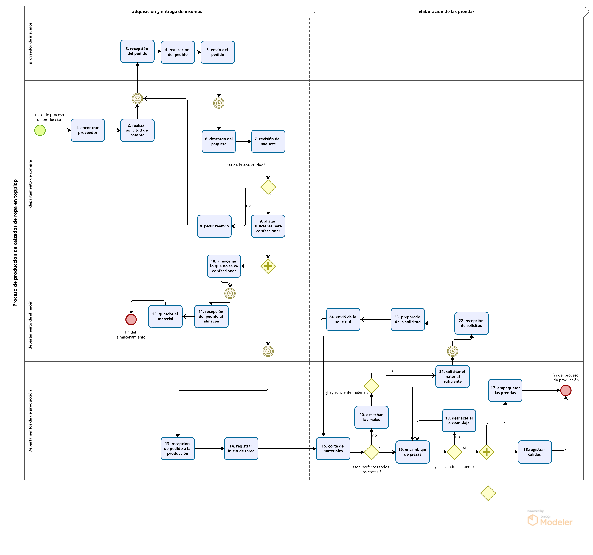

# PROCESO DE PRODUCCION DE LA EMPRESA TOPITOP

## ACTIVIDAD PRINCIPAL
En el proceso de producción de una empresa textil, la actividad principal es la fabricación de productos textiles. Comienza con el diseño de los productos y la adquisición de materiales como telas y hilos. Luego, se cortan las telas según los patrones diseñados y se ensamblan para crear los productos. Después, se realiza el acabado, que puede incluir planchado y tintado. Durante todo el proceso, se lleva a cabo un estricto control de calidad. Finalmente, los productos se empaquetan y se envían a los clientes o puntos de venta.

## RESPONSABLES DEL PROCESO

* **OPERARIO**: Es el trabajador encargado de llevar a cabo las tareas específicas dentro del proceso de producción, como cortar tela, coser piezas, planchar, entre otras actividades operativas.
* **GESTOR DE PRODUCCIÓN**: Es el encargado de planificar,supervisar, organizar, coordinar y dirigir todas las actividades relacionadas con la producción. Su responsabilidad principal es garantizar que se cumplan los objetivos de producción de la empresa en términos de calidad, cantidad y tiempo además de garantiza la eficiencia en el flujo de trabajo. Tambien cumple con funciones de gestionar y coordinar la adquisición de materiales, equipos y suministros necesarios para el proceso de producción y asegura que los materiales estén disponibles según las necesidades de producción.

## FLUJOGRAMA DEL PROCESO DE PRODUCCION
### PROCESO AS-IS

**Hecho en BIZAGI**

| Secuencia | Actividad                                          | Descripción         | Responsable  |
| --------- | -------------------------------------------------- | ------------------- | ------------ |
| 1         | Encontrar Proveedor | Implica la búsqueda y selección de proveedores potenciales que puedan satisfacer las necesidades de la producción, evaluando su idoneidad, reputación y capacidad para suministrar los insumos requeridos. | Gestor de Producción |
| 2         | Realizar solicitud de compra | Consiste en la elaboración y envío de una solicitud formal de compra a un proveedor seleccionado, detallando los insumos requeridos, las cantidades, especificaciones y cualquier otra información relevante. | Gestor de Producción |
| 3         | Recepción de pedidos | Refiere al proceso de recibir los pedidos de compra realizados por la empresa, verificando que coincidan con las especificaciones y cantidades solicitadas, y registrando la recepción de manera adecuada en el sistema.| Agente externo |
| 4         | Realización de pedidos | Implica la preparación y tramitación de los pedidos de compra, incluyendo la verificación de existencias, la elaboración de la orden de compra y su envío al proveedor correspondiente. | Agente externo |
| 5         | Envío de pedidos | Consiste en la entrega física o envío de los productos o servicios solicitados al destinatario o cliente, asegurándose de cumplir con los plazos de entrega acordados y de mantener una comunicación adecuada con el destinatario. | Agente externo |
| 6         | Descarga de paquete | Refiere al proceso de recepción y descarga física de los paquetes o mercancías entregados por el proveedor, verificando que coincidan con los pedidos realizados y registrando su recepción de manera adecuada. | Operario |
| 7         | Revisión de paquete | Implica la inspección y verificación de los insumos recibidos, asegurándose de su calidad, cantidad y conformidad con las especificaciones del pedido, y reportando cualquier discrepancia o problema identificado.  | Gestor de Producción |
| 8         | Solicitar reenvió | Consiste en solicitar un reenvio al proveedor por insumos que no cumplan con las especificaciones o que presenten defectos, siguiendo los procedimientos y políticas establecidos por el área y el proveedor.  | Gestor de Producción |
| 9         | Alistar suficiente material para confeccionar | Este proceso implica revisar el inventario de materiales necesarios para la producción de prendas y asegurarse de que haya suficiente cantidad disponible para cumplir con los pedidos.| Gestor de Producción |
| 10        |Almacenar lo que no se va a confeccionar | Implica el almacenamiento adecuado de los productos o materiales que no se van a utilizar inmediatamente en la producción o venta, asegurándose de mantener su integridad y calidad hasta su uso futuro o su disposición final. | Operario y Gestor de Producción |
| 11        | Recepcion del pedido al almacen | Cuando se recibe un pedido de materiales, este proceso implica registrar y verificar los productos recibidos en el almacén. |Gestor de Producción |
| 12        | Guardar el material | implica almacenar de manera organizada y segura los materiales que no serán utilizados inmediatamente en la producción, pero que se conservarán para proyectos futuros. Esto incluye etiquetar claramente los materiales, controlar el inventario y protegerlos de daños o pérdidas en un lugar accesible dentro del almacén. | Operario|
| 13        | Recepcion de pedido a la produccion | Después de que los materiales innecesarios son almacenados, se realiza el proceso de verificar que los insumos llegaron al área correspondiente para que se inicien los pasos de fabricación. | Gestor de Producción |
| 14        | Registro de inicio de tarea | el gestor distribuye las tareas del día a los diferentes operarios | Gestor de la producción |
| 15        | Envío de solicitud de maquinaria  |el Operario manda una solicitud para solicitar las herramientas y maquinarias necesarias | Operario |
| 16        | Recepcion de pedido a la produccion |la solicitud llegas al gestor de producción y este le asigna la maquinaria y las herramientas necesarias| Gestor de producción |
| 17        | Envío de la maquinaria y herramienta  | la maquinaria y herramientas son enviados a su respectivo operario | Gestor de producción |
| 18        | Corte de materiales | En este proceso se cortan los materiales según las especificaciones requeridas para la fabricación de las prendas. | Operario|
| 19      | Ensamblaje de piezas | Después del corte de los materiales, se ensamblan las diferentes piezas para formar las prendas. | Operario|
| 20        | Empaquetar las prendas | Una vez que las prendas están ensambladas, se procede a empaquetarlas para su envío o almacenamiento. | Operario |
| 21      |Registrar calidad | Una vez que se procede a empaquetar las prendas al mismo tiempo se hace el registro de la calidad de los productos , como cuales fueron los inconvenientes en el proceso. | Gestor de producción |
| 22       | Deshacer el embalaje | Este proceso implica abrir los paquetes recibidos de materiales o productos, para su inspección y utilización en la producción.| Operario |
| 23        | Deshechar los malos cortes| Durante el proceso de corte de materiales, es posible que se produzcan cortes defectuosos o inservibles, los cuales deben ser desechados adecuadamente. | Operario |
| 24        | Solicitar el material suficiente |Cuando se detecta que hay una escasez de materiales, se realiza una solicitud al área de almacén para reabastecer los suministros.| Gestor de Producción |
| 25        | Recepcion de solicitud | El almacén recibe la solicitud de material y procede a preparar los productos solicitados. | Gestor de Producción |
| 26        | Preparado de la solicitud  | En este proceso, el personal del almacén prepara los materiales solicitados para su envío o entrega al área de producción.  | Gestor de Producción |
| 27        | Envio de la solicitud | Finalmente, los materiales solicitados son enviados desde el almacén hasta el área de producción para su utilización en el proceso de fabricación de prendas.  | Gestor de Producción |

### PROCESO TO-BE

| Secuencia | Actividad                                          | Descripción         | Responsable  |
| --------- | -------------------------------------------------- | ------------------- | ------------ |
| 1         | Logeo del Usuario |  | Gestor de Producción y Operarios |
| 2         | Encontrar Proveedor | Implica la búsqueda y selección de proveedores potenciales que puedan satisfacer las necesidades de la producción, evaluando su idoneidad, reputación y capacidad para suministrar los insumos requeridos. | Gestor de Producción |
| 3         | Solicitud y adquisición de insumos | Consiste en la elaboración y envío de una solicitud formal de compra a un proveedor seleccionado, detallando los insumos requeridos, las cantidades, especificaciones y cualquier otra información relevante, esto ya de manerá automatizada al recibir los insumos pedidos. | Gestor de Producción |
| 4         | Descarga de paquete | Refiere al proceso de recepción y descarga física de los paquetes o mercancías entregados por el proveedor, verificando que coincidan con los pedidos de insumos realizados y registrando su recepción de manera adecuada. | Operario |
| 5         | Revisión de paquete | Implica la inspección y verificación de los insumos recibidos, asegurándose de su calidad, cantidad y conformidad con las especificaciones del pedido, y reportando cualquier discrepancia o problema identificado.  | Gestor de Producción |
| 6         | Solicitar reenvió | Consiste en solicitar un reenvio al proveedor por insumos que no cumplan con las especificaciones o que presenten defectos, siguiendo los procedimientos y políticas establecidos por el área y el proveedor.  | Gestor de Producción |
| 7         | Alistar suficiente material para confeccionar | Este proceso implica revisar el inventario de materiales necesarios para la producción de prendas y asegurarse de que haya suficiente cantidad disponible para cumplir con los pedidos.| Gestor de Producción |
| 8         |Almacenar lo que no se va a confeccionar | Implica el almacenamiento adecuado de los productos o materiales que no se van a utilizar inmediatamente en la producción o venta, asegurándose de mantener su integridad y calidad hasta su uso futuro o su disposición final. | Operario y Gestor de Producción |
| 9         | Recepcion del pedido al almacen | Cuando se recibe un pedido de materiales, este proceso implica registrar y verificar los productos recibidos en el almacén. |Gestor de Producción |
| 10         | Guardar el material | mplica almacenar de manera organizada y segura los materiales que no serán utilizados inmediatamente en la producción, pero que se conservarán para proyectos futuros. Esto incluye etiquetar claramente los materiales, controlar el inventario y protegerlos de daños o pérdidas en un lugar accesible dentro del almacén. | Operario|
| 11        | Recepcion de pedido a la produccion | Después de que los materiales innecesarios son almacenados, se realiza el proceso de verificar que los insumos llegaron al área correspondiente para que se inicien los pasos de fabricación. | Gestor de Producción |
| 12        | asignación de herramientas |El operario se encarga de enviar una solicitud y Gestor de la producción le asigna una maquinaria y/o una herramienta disponible | Gestor de Producción y Operario |
| 13        | Registrar inicio de Tarea|el gestor distribuye las tareas del día a los diferentes operarios | Gestor de Producción |
| 14        | Corte de materiales | En este proceso se cortan los materiales según las especificaciones requeridas para la fabricación de las prendas. | Operario|
| 15        | Ensamblaje de piezas | Después del corte de los materiales, se ensamblan las diferentes piezas para formar las prendas. | Operario|
| 16        | Empaquetar las prendas | Una vez que las prendas están ensambladas, se procede a empaquetarlas para su envío o almacenamiento. | Operario |
| 17        | Deshacer el embalaje | Este proceso implica abrir los paquetes recibidos de materiales o productos, para su inspección y utilización en la producción.| Operario |
| 18        | Deshechar los malos cortes| Durante el proceso de corte de materiales, es posible que se produzcan cortes defectuosos o inservibles, los cuales deben ser desechados adecuadamente. | Operario |
| 19        | Solicitud y recibimiento del material suficiente |Cuando se detecta que hay una escasez de materiales, se realiza una solicitud al área de almacén para reabastecer los suministros, este proceso sumergirá una automatización para dar abasto a todas las solicitudes.  | Gestor de Producción |
| 20      |Registrar calidad | Una vez que se procede a empaquetar las prendas al mismo tiempo se hace el registro de la calidad de los productos , como cuales fueron los inconvenientes en el proceso. | Gestor de producción |
| 21      |Reclamos y observaciones | los reclamos y observaciones que llegan al gestor de la producción | gestor de la producción

## GLOSARIO
1. **Insumos**: En el contexto de la empresa, los insumos son los materiales y componentes básicos necesarios para la fabricación de los prendas textiles. 
2. **Piso de Produccion**: Es el área física donde se llevan a cabo las actividades de fabricación, ensamblaje, procesamiento y control de calidad de los productos o servicios de una empresa. Es el lugar donde los trabajadores realizan las tareas relacionadas con la producción.
3. **Descarga de paquete**: Se refiere al proceso de recibir físicamente los productos o mercancías entregadas por el proveedor, verificando que coincidan con los pedidos realizados y registrando su recepción de manera adecuada.
4. **Proveedor de archivos**: Se refiere a la persona o equipo encargado de gestionar y mantener los registros y documentos relacionados con los proveedores de una empresa, incluyendo contratos, cotizaciones, pedidos y comunicaciones.

[Selección de la empresa](SeleccionEmpresa.md)

[Regresar al índice](../README.md)
