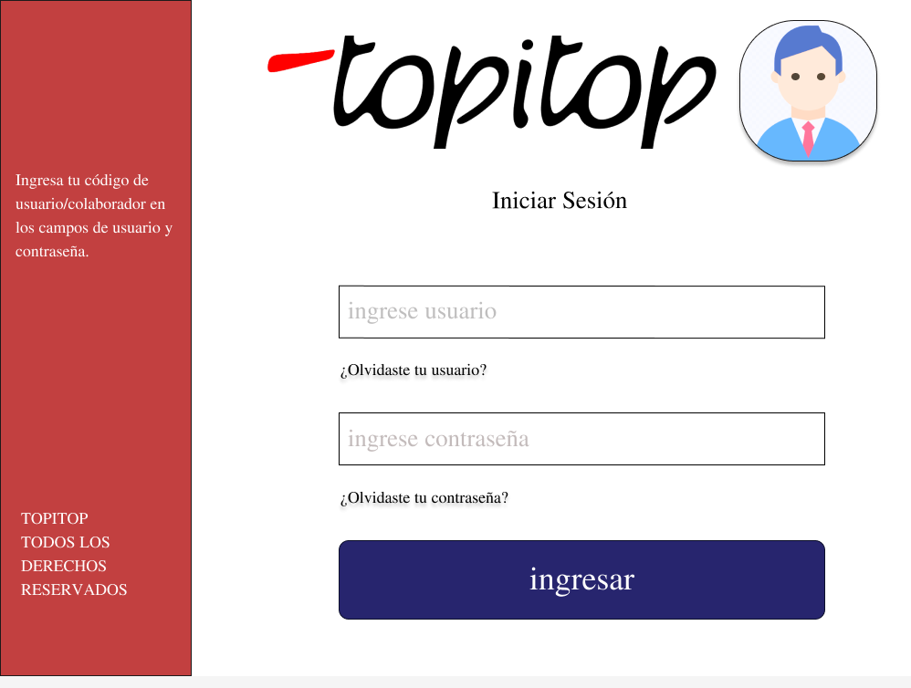

# PROTOTIPO
## Pantalla de inicio de sesión:
El empleado tendrá que ingresar su usuario y contraseña.En caso se olvide tanto el usuario como la contraseña debera enviar una solicitud de informacion al supervisor 

# USUARIO: EMPLEADO
## Solicitud de herramientas:
El empleado selecciona la máquina necesaria de manera intuitiva, especifica la actividad a realizar y proporciona los tiempos de inicio y fin de uso. Una vez completada la solicitud, esta se envía para su revisión y aprobación. Una vez aprobada, el empleado recibe la notificación y puede recoger la máquina solicitada para comenzar su labor en la empresa textil, agilizando así el proceso de obtención de herramientas.

## Plataforma de Registro:
El empleado se registra en la aplicacion , seleccionando la actividad a realizar .Asi como la hora de inicio y la hora de acabado

# USUARIO: JEFE DE INGENIERÍA

## Seguimiento de Trabajadores:
El jefe de ingenieria puede corroborar la actividad de los operarios como la fecha ,hora y estado del trabajo realizado 

## Solicitud de herramienta 
El jefe de ingeniería atiende las solicitudes para el uso de herramientas y maquinarias de los trabajadores, aceptarlos si hay disponibilidad.

