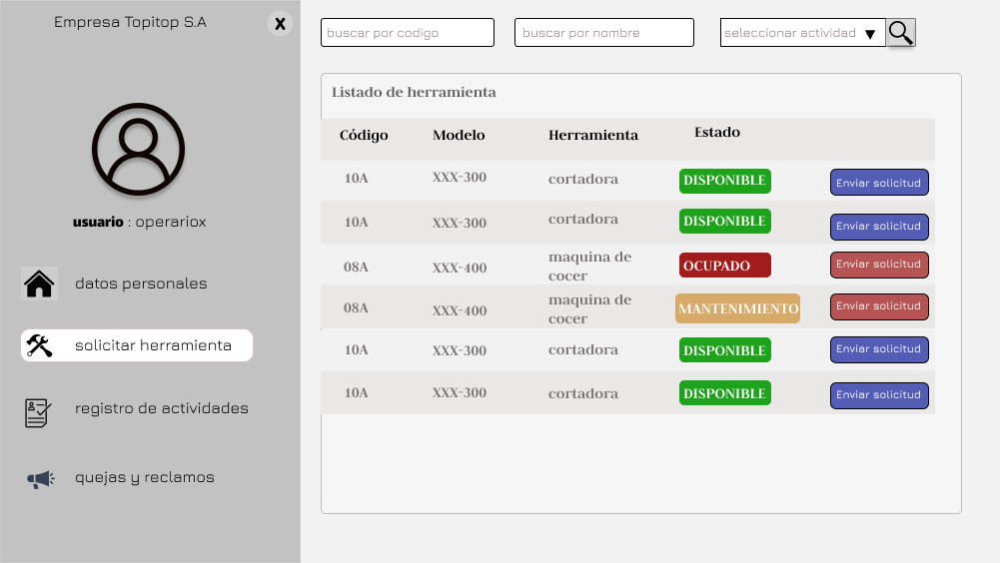
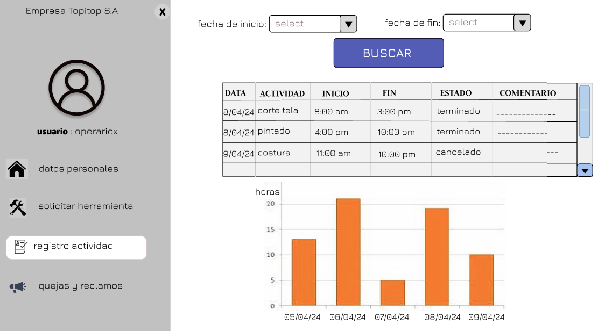

# PROTOTIPO
## Pantalla de inicio de sesión:
El empleado tendrá que ingresar su usuario y contraseña.En caso se olvide tanto el usuario como la contraseña debera enviar una solicitud de informacion al supervisor 

# USUARIO: OPERARIO
## Solicitud de herramientas:
El empleado selecciona la máquina necesaria de manera intuitiva, especifica la actividad a realizar y proporciona los tiempos de inicio y fin de uso. Una vez completada la solicitud, esta se envía para su revisión y aprobación. Una vez aprobada, el empleado recibe la notificación y puede recoger la máquina solicitada para comenzar su labor en la empresa textil, agilizando así el proceso de obtención de herramientas.

## Plataforma de Registro de actividades:
El operario se registra en la pagina web, va al apartado de registro de actividades y observa todas las actividades que ha trabajado en un determinado tiempo que puede escoger. Asi como la hora de inicio y la hora de inicio y acabado de cada actividad, también observará podrá observar un pequeño diagrama de cuantas horas ha trabajado durante los ultimos dias.

## Plataforma de Quejas y Reclamos:
El empleado se dirige al apartado de quejas y reclamos, el cual ofrece la opción de realizar un nuevo reclamo y presenta el historial de reclamos realizados. Dicho historial muestra datos como la fecha del reclamo, la categoría del reclamo, el motivo del reclamo y el estado en el que se encuentra dicho reclamo.

Si el usuario desea realizar un nuevo reclamo, le aparecerán opciones para concretar dicha operación, como la selección de la categoría del reclamo y el motivo de dicho reclamo. Una vez completados dichos campos, el usuario deberá seleccionar la opción "enviar reclamo" para el envío y procesamiento del reclamo.

# USUARIO: GESTOR DE PRODUCCIÓN

## Solicitud de herramienta 
El jefe de ingeniería atiende las solicitudes para el uso de herramientas y maquinarias de los trabajadores, aceptarlos si hay disponibilidad.

## Plataforma de Registro de actividades:
El gestor de producción se registra en la pagina web, va al apartado de registro de actividades y observa todas las actividades que ha trabajado en un determinado tiempo que puede escoger uno o varios operarios o gestores de producción asi como la hora de inicio y la hora de inicio y acabado de cada actividad, también el gestor de producción se encarga de agregar las actividades que hagan los operarios según sea su supervisión de los avances de estos.

[Selección de la empresa](SeleccionEmpresa.md)

[Regresar al índice](../README.md)
